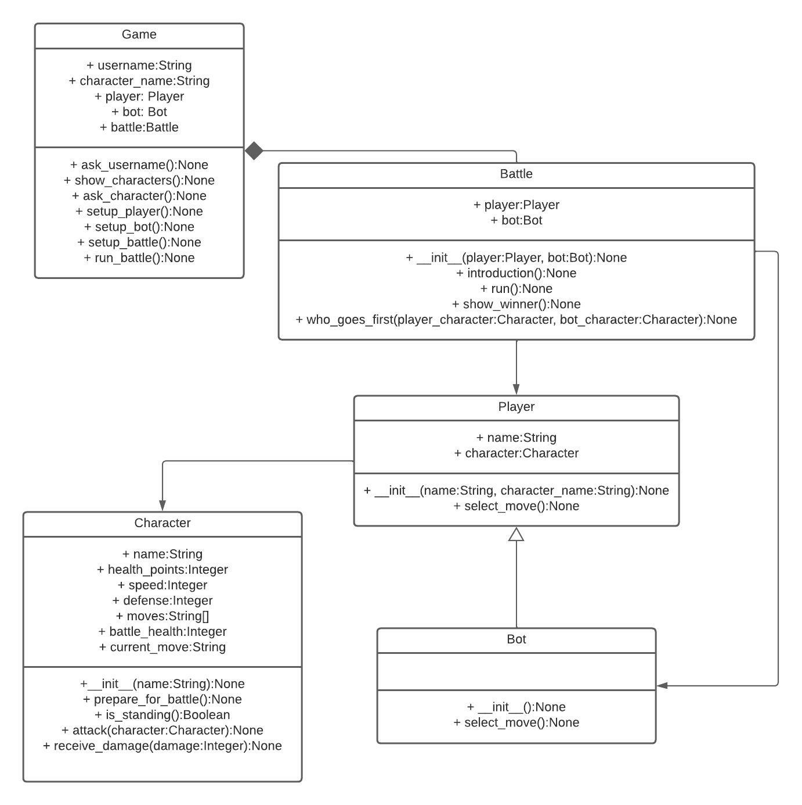

# Pokemon Battle :: Unitechies 23-1

- Para comenzar un juego, tú como jugador debes elegir un nombre y un tipo de personaje.

- Según el tipo seleccionado, tendrás un conjunto de puntos y movimientos para desafiar al Bot generado por el software.

- Una vez que ingreses a la batalla, deberás elegir un movimiento para desafiar al Bot, si las cosas van bien, lo dañarás, de lo contrario, serás dañado.

- La batalla continuará hasta que uno de ustedes se desmaye.

- Si ese es el caso, el juego declarará un ganador.

## Diagrama de secuencia

Esta es la secuencia que deberá seguir el software a desarrollar.


## Diagrama de clases

Estas son las clases sugeridas para completar el software, el software puede variar si el equipo lo considera adecuado siempre y cuando el resultado final sea el mismo.



## Ejemplo de ejecución


## Script de ejecución (`main.py`)

```python
game = Game()

game.ask_username()
# Cómo te llamas?
# Jon
game.show_characters()
# bulbasaur, charmander, squirtle, pikachu, snorlax, pidgeotto
game.ask_character()
# Qué personaje quieres utilizar?
# bulbasaur
game.setup_player() # Inicializa el jugador
game.setup_bot() # Inicializa el bot
game.setup_battle()
#  {player.name} reta al {bot.character.name} de {bot.name} con {player.character.name}
game.run_battle()
# {player.character.name}: {player.character.battle_health} ==== {bot.character.name}: {bot.character.battle_health}
# Tus movimientos son: {player.character.moves}
# fire punch
# {player.name} eligio:
# {player.character.current_move}
# {bot.name} eligio:
# {bot.character.current_move}
# {player.character.name} ha usado {player.character.current_move}
# Ha golpeado a {bot.character.name} y le ha causado {damage} de daño
# {bot.character.name} ha usado {bot.character.current_move}
# Ha golpeado a {player.character.name} y le ha causado {damage} de daño
# {player.name} ha ganado! {bot.name} ha perdido Dx
```

## Pseudocódigo de Clases

### Game

```python
def ask_username():
  # imprime "Cómo te llamas?" en consola
  # asigna el input del usuario a la propiedad username
```

```python
def show_characters():
  # transforma el diccionario de POKEMONS en una lista
  # imprime la lista en consola
```

```python
def ask_character():
  # mientras que el nombre del personaje no se encuentre en la lista de pokemones:
  #     pregunta "Qué personaje quieres utilizar?"
  # asigna el input del usuario a la propiedad character_name
```

```python
def setup_player():
  # asigna a la propiedad player una instancia de la clase Player pasándole como argumentos las propiedades username y character_name
```

```python
def setup_bot():
  # asigna a la propiedad bot una instancia de la clase Bot
```

```python
def setup_battle():
  # asigna a la propiedad battle una instancia de la clase Battle pasándole como argumentos las propiedades player y bot
```

```python
def run_battle():
  # ejecuta el método run de la propiedad battle
```

### Player

```python
def __init__(name, character_name):
  # asigna a la propiedad name el parámetro name
  # asigna a la propiedad character una instancia de la clase Character pasándole como argumento el parámetro character_name
```

```python
def select_move():
  # mientras que la variable move no se encuentre en los moves de la instancia character:
  #     imprime "Tus movimientos son: {self.character.moves}"
  #     asigna a la variable move el input del usuario
  # asigna a la propiedad current_move de la instancia character el valor de la variable move
  # imprime "{name} eligió:"
  # imprime la propiedad current_move de la instancia character
```

### Bot

```python
def __init__():
  # transforma el diccionario de POKEMONS en una lista
  # selecciona un nombre al azar y asignalo a una variable
  # invoca el método de la superclase pasándole como argumento name el valor "PokeBot" y como argumento character_name la variable que creaste un paso antes
```

```python
def select_move():
  # toma un movimiento aleatorio de los moves de la instancia character y asignalo a una variable
  # asigna a la propiedad current_move de la instancia character el valor de esa variable
  # imprime "{name} eligió:"
  # imprime la propiedad current_move de la instancia character
```

### Character

```python
def __init__(name):
  # asigna a una variable de nombre pokemon los datos que corresponden al parametro name del catálogo de POKEMONS -esta variable es un diccionario-
  # asigna a la propiedad name el valor del parámetro name
  # asigna a la propiedad health_points el valor "hp" del diccionario pokemon
  # asigna a la propiedad speed el valor "speed" del diccionario pokemon
  # asigna a la propiedad defense el valor "defense" del diccionario pokemon
  # asigna a la propiedad moves el valor "moves" del diccionario pokemon
```

```python
def prepare_for_battle():
  # asigna a la propiedad battle_health el valor de la propiedad health_points
  # asigna a la propiedad current_move un string vacío
```

```python
def is_standing():
  # regresa un booleano que indica que la propiedad battle_health es mayor a cero
```

```python
def attack(character):
  # imprime en consola "{name} ha usado {current_move}"
  # declara una variable damage cuyo valor es la llave power del catalogo de MOVES
  # invoca el método receive_damage del parámetro character pasándole como argumento la variable damage
  # imprime en consola "Ha golpeado a {character.name} y le ha causado {damage} de daño"
```

```python
def receive_damage(damage):
  # asigna a la propiedad battle_health el resultado de restar el valor del parámetro damage a la propiedad battle_health
```

### Battle

```python
def __init__(player, bot):
  # asigna a la propiedad player el valor del parámetro player
  # asigna a la propiedad bot el valor del parámetro bot
```

```python
def introduction():
  # imprime en consola "{player.name} reta al {bot.character.name} de {bot.name} con {player.character.name}"
```

```python
def run():
  # ejecuta el método prepare_for_battle() de la instancia character que contiene la instancia player
  # ejecuta el método prepare_for_battle() de la instancia character que contiene la instancia bot
  # mientras la propiedad character del player y del bot sigan en pie:
  #     imprime en consola "{player.character.name}: {player.character.battle_health} ==== {bot.character.name}: {bot.character.battle_health}"
  #     ejecuta el método select_move() de la instancia player
  #     ejecuta el método select_move() de la instancia bot
  #     asigna a la variable first el resultado de invocar al método who_goes_first()
  #     asigna a la variable second el valor de la instancia character de la propiedad bot si first es igual a la instancia character de la propiedad player, sino asigna el valor de la instancia character de la propiedad player
  #     ejecuta el método attack de la variable first
  #     si second sigue en pie:
  #         ejecuta el método attack de la variable second
  # ejecuta el método show_winner()
```

```python
def show_winner(character):
  # asigna a la variable winner el valor de la propiedad player si el character del player sigue en pie, sino el valor de la propiedad bot
   # asigna a la variable loser el valor de la propiedad bot si el winner es el player, sino el valor de la propiedad player
   # imprime en consola "{winner.name} ha ganado! {loser.name} ha perdido Dx"
```

```python
def who_goes_first(player_character, bot_character):
  # si la velocidad del player_character es mayor o igual a la velocidad del bot_character
  #     regresa el player_character
  # si la velocidad del bot_character es mayor a la velocidad del player_characteer
  #     regresa el bot_character
```
